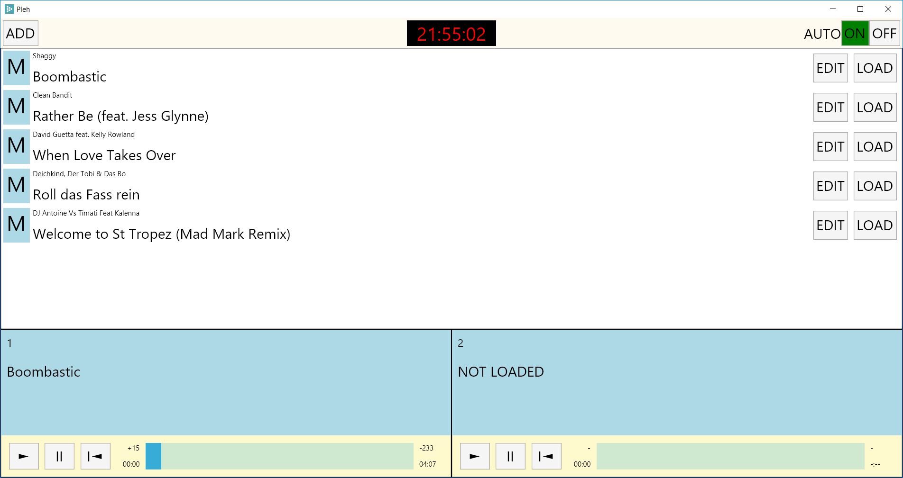

# Pleh
  

Pleh is a tiny piece of software meant for unattended playlist automation. Just load your playlist, flip the AUTO switch and it will go and go. 

It is somewhat different from usual audio players in that the way audio clips are handled is customizable, much like radio automation software
which this has been inspired by. You can set fade and ramp points. Clips that are set to be voice tracks will actually attempt ramp talk.

*ATTN: This software is an aside project of mine. It is heavily WIP and might just never be finished. I do however hope that you can find joy in using it just as i found joy in developing it*

## Players and Playlist
Pleh has two players and one playlist. This means that two clips can actually play at the same time which is useful for voicetracks over music for example. You can load and play
the playlist clips by yourself or flip the AUTO switch and watch the magic happen.

## Audio Metadata
Obviously for keeping information about fade out/in and ramps, Pleh will have to write metadata. It will not touch your original files but create a separate metafile in its application data
directory, identifying the file by its hash. That means that you are free to move your files around without losing the metadata you have previously entered. You should however create a copy
of your application data of you plan to move devices.